# Introduction to Digital Mapping with Leaflet
Online tutorials for Leaflet Web Mapping

## Contents

- [Lesson 1: Finding and Wrangling Data, Basic Web Map Code Structure, Open Source Base Maps](#week-1-finding-and-wrangling-data-basic-web-map-code-structure-open-source-base-maps)
  - [The Basic Components of a Leaflet Web Map](#the-basic-components-of-a-leaflet-web-map)
  - [Finding and Wrangling Data](#finding-and-wrangling-data)
  - [Basic Web Map Coding](#basic-web-map-coding)

## Lesson 1: Finding and Wrangling Data, Basic Web Map Code Structure, Open Source Base Maps
In this class, we will explore the [Leaflet JavaScript](https://leafletjs.com/) library for making interactive online maps. While it will help, there is no expectation that you be familiar with JavaScript or be able to write JavaScript from memory as a consequence of this class. This class is meant to familiarize yourself with learning how to use various web-based resources (including the tutorials presented here) to modify and apply Leaflet JavaScript to deploy an online map that you can host from GitHub and share with others.

### The Basic Components of a Leaflet Web Map
Every map will start with an html file, here called "index.html". Inside this file, you will include the HTML (Hypertext Markup Language) template code that tells the web browser how to display your map. You will copy and paste this in your own index.html file at a later step. Within this file, you will also include the CSS (Cascading Style Sheets) code that allows you to customize the appearance of elements included in your web map. CSS gives you artistic license over stylistic aspects of your web map. Finally, you will also write the Leaflet JavaScript within the index.html file. Leaflet is a JavaScript library that allows you to build web mapping applications. It is not the only one, but perhaps the most comprehensive. Mapbox GL JS is another good one, for example.

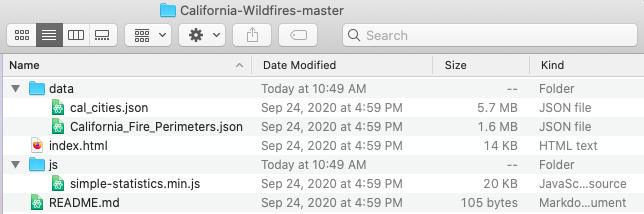  
**Figure 01**. The folder structure of a web map.

In the image above, you will notice there are a few more files and subdirectories. You will replicate this folder structure. First, you will notice a data folder with some JSON (JavaScript Object Notation) files. If you have used ArcGIS, you might be familiar with ESRI Shapefiles. However, because we are now mapping in JavaScript, we need our geographical data in JSON/GeoJSON format. In the image above the JSON files correspond to polygons representing California cities and areas burned by wildfires in California over the last decade.

Next, you will notice a js folder. This folder contains a supplementary JavaScript library called [Simple Statistics](https://simplestatistics.org/). Whereas Leaflet is specifically for geovisualization, this JavaScript library performs statistical analysis. There are many JavaScript libraries you can take advantage of to assist with data visualization, and we will take a quick look at a few during this course.

Also, you will see a file called README.md. In this case, this is a Markdown file that provides some brief explanatory text about your map for other GitHub users. It is not necessary, but you will see how it can help others evaluate and use your data in the open source GitHub environment.

Finally, you are probably wondering what all of this GitHub stuff is. [GitHub](https://github.com/) is an IT service management company that provides hosting for developers. In this class, we will use it to host our files and publish our map.

### Finding and Wrangling Data
By now, you have probably figured out that we will be mapping California wildfires and their proximity to urban areas over the last decade. Where can we download this data? Usually, I simply search Google for some reputable data sources. In this case, I have done the searching for you.

Before downloading any data, set up your project folder as follows. Make a new folder on your desktop called "california-fires" and, inside of it, create a folder called "data" for the data you will download. Create another folder called "js" for the Simple Statistics JavaScript library. It should look as follows:

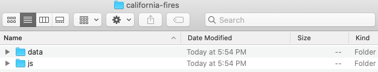  
**Figure 02**. Initial folder structure.

At [ArcGIS Hub](https://hub.arcgis.com/datasets/653647b20bc74480b335e31d6d81a52f/data?geometry=-151.022%2C31.426%2C-87.741%2C43.578&layer=1&orderBy=YEAR_&orderByAsc=false), you can find polygons delimiting all burned areas in California for the 2010s. Go ahead and click the link above. Then select Download >> Shapefile under "Full Dataset" as shown below.

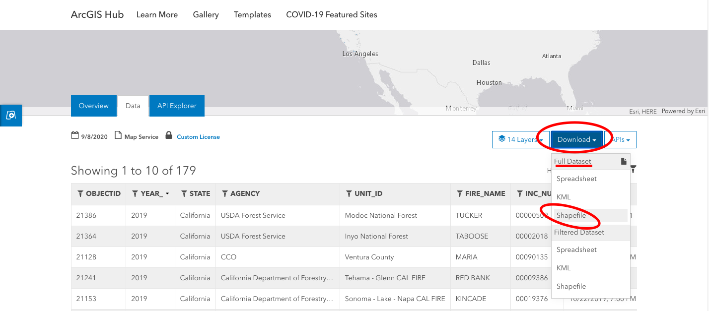  
**Figure 03**. Downloading the California wildfire data.

In your downloads folder, you will now see the shapefile containing the data. However, as described above, this is the wrong data format for JavaScript web mapping. We need this in JSON (JavaScript Object Notation) format. What to do?

[Mapshaper](https://mapshaper.org/) by [Matthew Bloch](https://www.nytimes.com/by/matthew-bloch) at the New York Times is a great way to quickly check and edit your geographic data without downloading and installing any GIS software. We can do a lot of neat things with this convenient web resource, including querying the data, simplifying it to reduce size, and exporting to other formats. Go ahead and drag the zipped shapefile into the empty window in Mapshaper and click "Import". You should now see the outlines of all the wildfires in the window. Query the polygons to see what kind of information is included with each polygon. Next, simplify the data to 5%, using the Douglas-Peucker algorithm. Then, repair the line intersections. From the options at the top right, click Export >> GeoJSON >> Export as shown below.

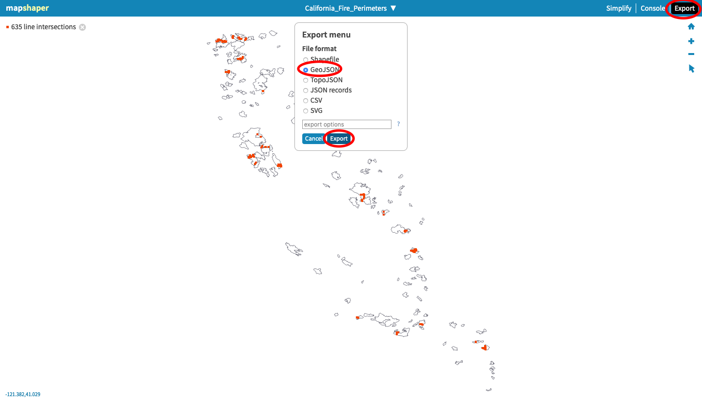  
**Figure 04**. Using Mapshaper to export the California wildfire data to a JSON file.

Make sure to save the exported JSON file in your "data" folder.

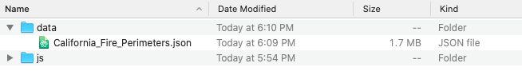  
**Figure 05**. Inside the data folder.

Now, we need the urban area boundaries. These can be found at [UC Berkeley Library's Geodata](https://geodata.lib.berkeley.edu/catalog/stanford-jt346pj7452) site. In this case, we have an option to export a GeoJSON file directly without needing to convert. As shown below, click the "Export" button next to "GeoJSON". Immediately, an announcement should appear at the top of the page saying that your file is ready for download. Click that and check your download folder.

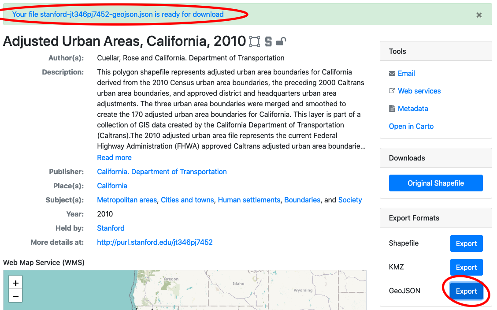  
**Figure 06**. Downloading the urban area boundaries.

Rename this file "California_Urban.json" and drop it into your "data" folder.

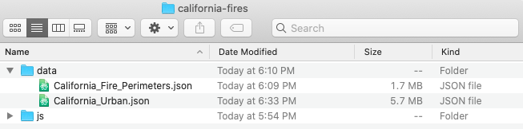  
**Figure 07**. Inside the data folder.

### Basic Web Map Coding

Now that we have our data, it is time to take an initial look at how Leaflet JavaScript works to build an interactive web map application. For this, we will need a good text editor to view and adapt the code to serve our needs. [Atom](https://atom.io/) is free and will serve our needs nicely. Go ahead and download it from the website linked above.

Once you have Atom installed, you will need a way to check your map-building progress as you edit your code (this will make sense later). You can do this with an Atom package called "atom-live-server". Open Atom and, from the bar at the top of the screen, select Atom >> Preferences or hold command + , to open Atom Preferences. From the options at the left, click "Install" and type "atom-live-server" into the search bar. Install the package.

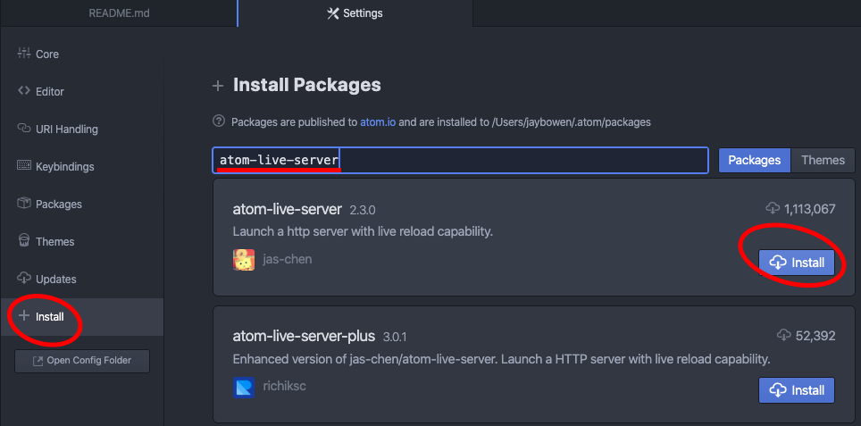  
**Figure 08**. Installing Atom Live Server.

Once you have done that, you can create your first html file with Atom. From the options at the bar at the top, click File >> New File or hold command + N. In this new document, copy and paste the following web map template code:

```html
<!DOCTYPE html>

<html lang="en">

<head>
  <meta charset="utf-8" />
  <!-- Give the page a title -->
  <title>California Wildfires</title>
  <!-- Add a link to the Leaflet CSS library so you can reference it for styling your map -->
  <link rel="stylesheet" href="https://unpkg.com/leaflet@1.6.0/dist/leaflet.css" />
  <!-- All the CSS code goes inside the style tags below -->
  <style>
    /* style the body */
    body {
      margin: 0px;
      height: 100%;
      width: 100%;
    }

    /* style the map */
    #map {
      position: absolute;
      width: 100%;
      top: 0px;
      bottom: 0;
    }
  </style>
</head>

<body>
  <!-- the map -->
  <div id="map"></div>
  <!-- Add a link to the Leaflet JavaScript library so you can reference it for building your map -->
  <script src="https://unpkg.com/leaflet@1.6.0/dist/leaflet.js"></script>
  <!-- All JavaScript goes inside the script tags below -->
  <script>
    // define map options
    const mapOptions = {
      zoomSnap: 0.5,  // this allows fractional zooming
      center: [37.5, -120], // center the map on the coordinates for California
      zoom: 6.5, // set the initial zoom
    };

    // define the map with the options above
    const map = L.map("map", mapOptions);

    // add a base map to the map
    L.tileLayer('https://{s}.tile.openstreetmap.org/{z}/{x}/{y}.png', {
    	maxZoom: 19,
    	attribution: '&copy; <a href="https://www.openstreetmap.org/copyright">OpenStreetMap</a> contributors'
    }).addTo(map);
  </script>
</body>

</html>
```

Now save this file as "index.html" in your "california-fires" project folder. Don't worry about understanding every line or memorizing the code. Just read through the comments that I have included with the code so that you can get familiar with being able to copy, adapt, and use code snippets to make your map work. After you save this index.html file, close Atom and open the entire "california-fires" project folder in a new Atom session. Click open index.html in Atom. Your screen should look like this:

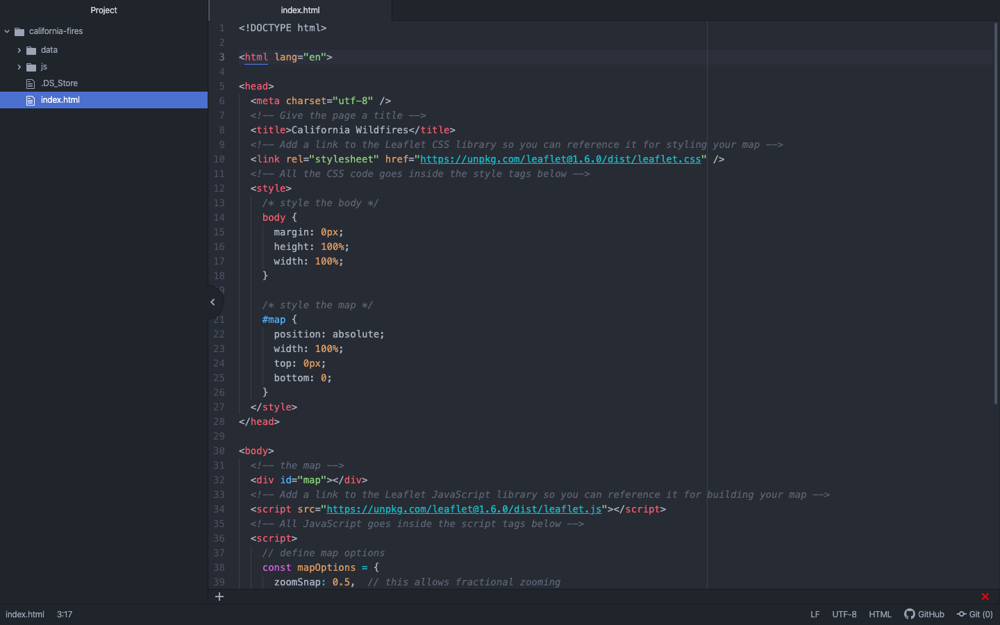  
**Figure 09**. Opening the map project with Atom.

Now, from the options at the top, navigate to Packages >> atom-live-server >> Start server. Upon opening your web browser, you should see a locally served map of California that looks like this:

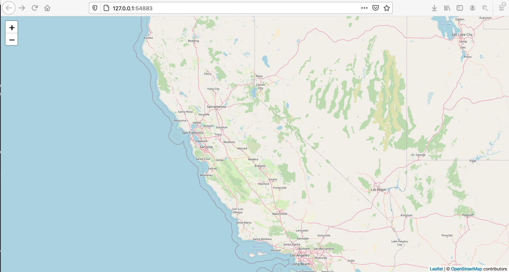  
**Figure 10**. The initial map in Atom Live Server.

To explain a little about what is happening here, take a look at the lines of code in the index.html file above. Towards the top, you have included a link to the Leaflet CSS library, so that you can use it to style your web map. Within the style tags, you have included some code that tells the page to fill the entire body of the page with the map. You could edit those map parameters and check the effects in live server if you want to understand more. We will be expanding upon this code later. Below that, within the body tags, you have specifically added the map to the body within a div, or container. Then, you have included a link to the Leaflet JavaScript library so that you can use it to build your web map. All of this code goes within the script tags beneath the link. Notice that you have defined the center of the map with coordinates (37.5, -120). These coordinates are in the center of the State of California. You can change these numbers and see how the map will move to a new location on the Earth. You also define the map (const map) using the mapOptions parameters above it. Finally, you have defined a base map with L.tileLayer. At [this site](https://leaflet-extras.github.io/leaflet-providers/preview/), Leaflet provides many other options for base maps that you can use. Let's change the base map now. Go ahead and swap out:

```js
L.tileLayer('https://{s}.tile.openstreetmap.org/{z}/{x}/{y}.png', {
  maxZoom: 19,
  attribution: '&copy; <a href="https://www.openstreetmap.org/copyright">OpenStreetMap</a> contributors'
}).addTo(map);
```

for:

```js
L.tileLayer('https://{s}.basemaps.cartocdn.com/dark_all/{z}/{x}/{y}{r}.png', {
  attribution: '&copy; <a href="https://www.openstreetmap.org/copyright">OpenStreetMap</a> contributors &copy; <a href="https://carto.com/attributions">CARTO</a>',
  subdomains: 'abcd',
  maxZoom: 20
}).addTo(map);
```

This gives the map a dark base map that minimizes the visual clutter so that we can bring our data to the foreground. When you make your own maps, you will want to think carefully about how your base map choice with work or clash with your data and choose appropriately. Now your map should look like this:

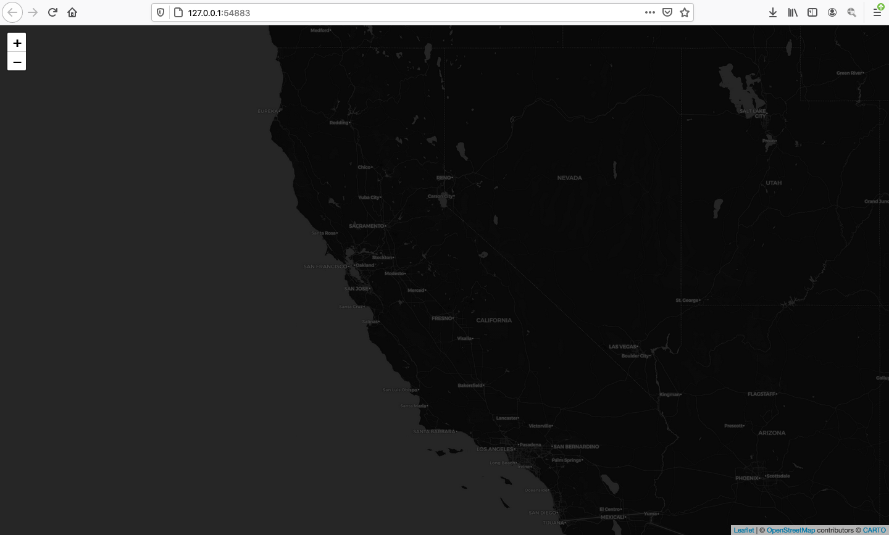  
**Figure 11**. Changing the base map.
