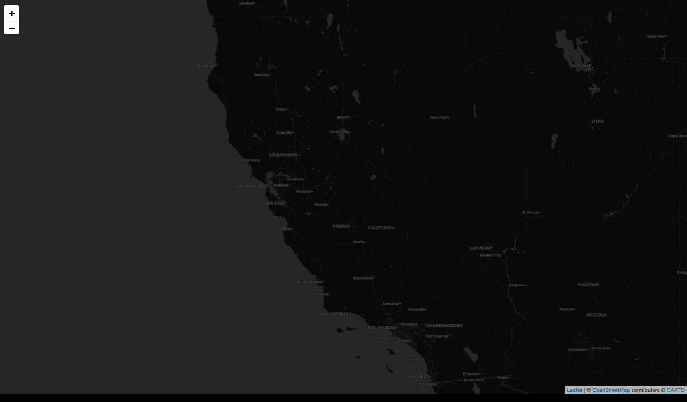
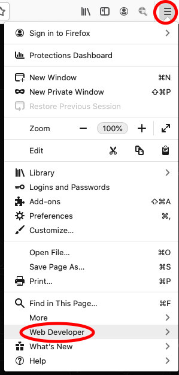
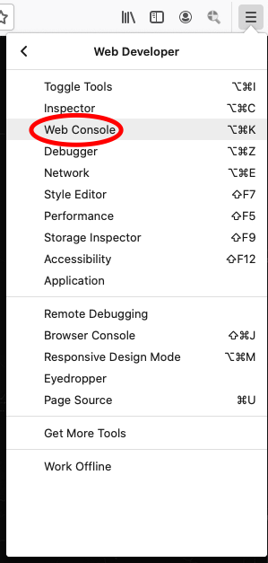
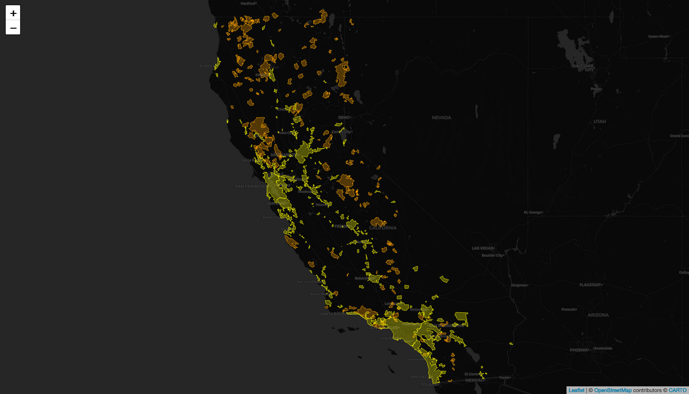

# Introduction to Digital Mapping with Leaflet
Online tutorials for Leaflet Web Mapping

## Contents

- [Lesson 1: Finding and Wrangling Data, Basic Web Map Code Structure, Open Source Base Maps](#lesson-1-finding-and-wrangling-data-basic-web-map-code-structure-open-source-base-maps)
  - [The Basic Components of a Leaflet Web Map](#the-basic-components-of-a-leaflet-web-map)
  - [Finding and Wrangling Data](#finding-and-wrangling-data)
  - [Basic Web Map Coding](#basic-web-map-coding)
  - [Open Source Base Maps](#open-source-base-maps)
  - [Lesson 1 Recap](#lesson-1-recap)
- [Lesson 2: Loading and Styling Data in a Leaflet Web Map](#lesson-2-loading-and-styling-data-in-a-leaflet-web-map)

## Lesson 1: Finding and Wrangling Data, Basic Web Map Code Structure, Open Source Base Maps
In this class, we will explore the [Leaflet JavaScript](https://leafletjs.com/) library for making interactive online maps. While it will help, there is no expectation that you be familiar with JavaScript or be able to write JavaScript from memory as a consequence of this class. This class is meant to familiarize yourself with learning how to use various web-based resources (including the tutorials presented here) to modify and apply Leaflet JavaScript to deploy an online map that you can host from GitHub and share with others.

### The Basic Components of a Leaflet Web Map
Every map will start with an html file, here called "index.html". Inside this file, you will include the HTML (Hypertext Markup Language) template code that tells the web browser how to display your map. You will copy and paste this in your own index.html file at a later step. Within this file, you will also include the CSS (Cascading Style Sheets) code that allows you to customize the appearance of elements included in your web map. CSS gives you artistic license over stylistic aspects of your web map. Finally, you will also write the Leaflet JavaScript within the index.html file. Leaflet is a JavaScript library that allows you to build web mapping applications. It is not the only one, but perhaps the most comprehensive. Mapbox GL JS is another good one, for example.

  
**Figure 01**. The folder structure of a web map.

In the image above, you will notice there are a few more files and subdirectories. You will replicate this folder structure. First, you will notice a data folder with some JSON (JavaScript Object Notation) files. If you have used ArcGIS, you might be familiar with ESRI Shapefiles. However, because we are now mapping in JavaScript, we need our geographical data in JSON/GeoJSON format. In the image above the JSON files correspond to polygons representing California cities and areas burned by wildfires in California over the last decade.

Next, you will notice a js folder. This folder contains a supplementary JavaScript library called [Simple Statistics](https://simplestatistics.org/). Whereas Leaflet is specifically for geovisualization, this JavaScript library performs statistical analysis. There are many JavaScript libraries you can take advantage of to assist with data visualization, and we will take a quick look at a few during this course.

Also, you will see a file called README.md. In this case, this is a Markdown file that provides some brief explanatory text about your map for other GitHub users. It is not necessary, but you will see how it can help others evaluate and use your data in the open source GitHub environment.

Finally, you are probably wondering what all of this GitHub stuff is. [GitHub](https://github.com/) is an IT service management company that provides hosting for developers. In this class, we will use it to host our files and publish our map.

### Finding and Wrangling Data
By now, you have probably figured out that we will be mapping California wildfires and their proximity to urban areas over the last decade. Where can we download this data? Usually, I simply search Google for some reputable data sources. In this case, I have done the searching for you.

Before downloading any data, set up your project folder as follows. Make a new folder on your desktop called "california-fires" and, inside of it, create a folder called "data" for the data you will download. Create another folder called "js" for the Simple Statistics JavaScript library. It should look as follows:

  
**Figure 02**. Initial folder structure.

At [ArcGIS Hub](https://hub.arcgis.com/datasets/653647b20bc74480b335e31d6d81a52f/data?geometry=-151.022%2C31.426%2C-87.741%2C43.578&layer=1&orderBy=YEAR_&orderByAsc=false), you can find polygons delimiting all burned areas in California for the 2010s. Go ahead and click the link above. Then select Download >> Shapefile under "Full Dataset" as shown below.

  
**Figure 03**. Downloading the California wildfire data.

In your downloads folder, you will now see the shapefile containing the data. However, as described above, this is the wrong data format for JavaScript web mapping. We need this in JSON (JavaScript Object Notation) format. What to do?

[Mapshaper](https://mapshaper.org/) by [Matthew Bloch](https://www.nytimes.com/by/matthew-bloch) at the New York Times is a great way to quickly check and edit your geographic data without downloading and installing any GIS software. We can do a lot of neat things with this convenient web resource, including querying the data, simplifying it to reduce size, and exporting to other formats. Go ahead and drag the zipped shapefile into the empty window in Mapshaper and click "Import". You should now see the outlines of all the wildfires in the window. Query the polygons to see what kind of information is included with each polygon. Next, simplify the data to 5%, using the Douglas-Peucker algorithm. Then, repair the line intersections. From the options at the top right, click Export >> GeoJSON >> Export as shown below.

  
**Figure 04**. Using Mapshaper to export the California wildfire data to a JSON file.

Make sure to save the exported JSON file in your "data" folder.

  
**Figure 05**. Inside the data folder.

Now, we need the urban area boundaries. These can be found at [UC Berkeley Library's Geodata](https://geodata.lib.berkeley.edu/catalog/stanford-jt346pj7452) site. In this case, we have an option to export a GeoJSON file directly without needing to convert. As shown below, click the "Export" button next to "GeoJSON". Immediately, an announcement should appear at the top of the page saying that your file is ready for download. Click that and check your download folder.

  
**Figure 06**. Downloading the urban area boundaries.

Rename this file "California_Urban.json" and drop it into your "data" folder.

  
**Figure 07**. Inside the data folder.

### Basic Web Map Coding

Now that we have our data, it is time to take an initial look at how Leaflet JavaScript works to build an interactive web map application. For this, we will need a good text editor to view and adapt the code to serve our needs. [Atom](https://atom.io/) is free and will serve our needs nicely. Go ahead and download it from the website linked above.

Once you have Atom installed, you will need a way to check your map-building progress as you edit your code (this will make sense later). You can do this with an Atom package called "atom-live-server". Open Atom and, from the bar at the top of the screen, select Atom >> Preferences or hold command + , to open Atom Preferences. From the options at the left, click "Install" and type "atom-live-server" into the search bar. Install the package.

  
**Figure 08**. Installing Atom Live Server.

Once you have done that, you can create your first html file with Atom. From the options at the bar at the top, click File >> New File or hold command + N. In this new document, copy and paste the following web map template code:

```html
<!DOCTYPE html>

<html lang="en">

<head>
  <meta charset="utf-8" />
  <!-- Give the page a title -->
  <title>California Wildfires</title>
  <!-- Add a link to the Leaflet CSS library so you can reference it for styling your map -->
  <link rel="stylesheet" href="https://unpkg.com/leaflet@1.6.0/dist/leaflet.css" />
  <!-- All the CSS code goes inside the style tags below -->
  <style>
    /* style the body */
    body {
      margin: 0px;
      height: 100%;
      width: 100%;
    }

    /* style the map */
    #map {
      position: absolute;
      width: 100%;
      top: 0px;
      bottom: 0;
    }
  </style>
</head>

<body>
  <!-- the map -->
  <div id="map"></div>
  <!-- Add a link to the Leaflet JavaScript library so you can reference it for building your map -->
  <script src="https://unpkg.com/leaflet@1.6.0/dist/leaflet.js"></script>
  <!-- All JavaScript goes inside the script tags below -->
  <script>
    // define map options
    const mapOptions = {
      zoomSnap: 0.5,  // this allows fractional zooming
      center: [37.5, -120], // center the map on the coordinates for California
      zoom: 6.5, // set the initial zoom
    };

    // define the map with the options above
    const map = L.map("map", mapOptions);

    // add a base map to the map
    L.tileLayer('https://{s}.tile.openstreetmap.org/{z}/{x}/{y}.png', {
    	maxZoom: 19,
    	attribution: '&copy; <a href="https://www.openstreetmap.org/copyright">OpenStreetMap</a> contributors'
    }).addTo(map);
  </script>
</body>

</html>
```

Now save this file as "index.html" in your "california-fires" project folder. Don't worry about understanding every line or memorizing the code. Just read through the comments that I have included with the code so that you can get familiar with being able to copy, adapt, and use code snippets to make your map work. After you save this index.html file, close Atom and open the entire "california-fires" project folder in a new Atom session. Click open index.html in Atom. Your screen should look like this:

  
**Figure 09**. Opening the map project with Atom.

Now, from the options at the top, navigate to Packages >> atom-live-server >> Start server. Upon opening your web browser, you should see a locally served map of California that looks like this:

  
**Figure 10**. The initial map in Atom Live Server.

To explain a little about what is happening here, take a look at the lines of code in the index.html file above. Towards the top, you have included a link to the Leaflet CSS library, so that you can use it to style your web map. Within the style tags, you have included some code that tells the page to fill the entire body of the page with the map. You could edit those map parameters and check the effects in live server if you want to understand more. We will be expanding upon this code later. Below that, within the body tags, you have specifically added the map to the body within a div, or container. Then, you have included a link to the Leaflet JavaScript library so that you can use it to build your web map. All of this code goes within the script tags beneath the link. Notice that you have defined the center of the map with coordinates (37.5, -120). These coordinates are in the center of the State of California. You can change these numbers and see how the map will move to a new location on the Earth. You also define the map (const map) using the mapOptions parameters above it.

### Open Source Base Maps

Finally, you have defined a base map with L.tileLayer. At [this site](https://leaflet-extras.github.io/leaflet-providers/preview/), Leaflet provides many other options for free base maps that you can use. Let's change the base map now. Go ahead and swap out:

```js
// add a base map to the map
L.tileLayer('https://{s}.tile.openstreetmap.org/{z}/{x}/{y}.png', {
  maxZoom: 19,
  attribution: '&copy; <a href="https://www.openstreetmap.org/copyright">OpenStreetMap</a> contributors'
}).addTo(map);
```

for:

```js
// add a base map to the map
L.tileLayer('https://{s}.basemaps.cartocdn.com/dark_all/{z}/{x}/{y}{r}.png', {
  attribution: '&copy; <a href="https://www.openstreetmap.org/copyright">OpenStreetMap</a> contributors &copy; <a href="https://carto.com/attributions">CARTO</a>',
  subdomains: 'abcd',
  maxZoom: 20
}).addTo(map);
```

This gives the map a dark base map that minimizes the visual clutter so that we can bring our data to the foreground. When you make your own maps, you will want to think carefully about how your base map choice with work or clash with your data and choose appropriately. Now your map should look like this:

  
**Figure 11**. Changing the base map.

### Lesson 1 Recap

This concludes the first lesson. By the end of this lesson, you should be familiar with finding and downloading geospatial data, converting these data into JSON format and reducing the file size using Mapshaper, organizing your project folder for web mapping, using Atom text editor for setting up a basic index template with HTML, Leaflet CSS, and Leaflet JavaScript in order to produce an initial web map, checking edits with Atom Live Server, centering the map on a specific geographic area using coordinates and zoom settings, and implementing different base maps with Leaflet JavaScript. These first steps are giant steps, so you might want to return to the beginning and review everything one more time to help it settle!

## Lesson 2: Loading and Styling Data in a Leaflet Web Map

Last time, we explored editing some basic Leaflet JavaScript in Atom to run a base map over the web. This time, we will be building out from this foundation, and you will learn how to add and style your GeoJSON data for effective geographic data visualization.

### Using jQuery Ajax Methods to Load Data

To help us do this more easily, we will get some assistance from a JavaScript library called [jQuery](https://jquery.com/). This library allows us to use ajax methods to load our data, which you can identify in the scripts starting with $. To add this library to your project, open your project in Atom and link to the jQuery library just below the link to the Leaflet JavaScript library in your index.html file.

```html
<!-- Add a link to the Leaflet JavaScript library so you can reference it for building your map -->
<script src="https://unpkg.com/leaflet@1.6.0/dist/leaflet.js"></script>
<!-- Add a link to the jQuery JavaScript library so you can leverage ajax methods to load your data -->
<script src="https://cdnjs.cloudflare.com/ajax/libs/jquery/3.5.1/jquery.min.js"></script>
```

Now you are able to use ajax methods to bring your JSON files into your web map. Just beneath the JavaScript that adds your base map to you web map, add the ajax requests like so:

```js
// add a base map to the map
L.tileLayer('https://{s}.basemaps.cartocdn.com/dark_all/{z}/{x}/{y}{r}.png', {
  attribution: '&copy; <a href="https://www.openstreetmap.org/copyright">OpenStreetMap</a> contributors &copy; <a href="https://carto.com/attributions">CARTO</a>',
  subdomains: 'abcd',
  maxZoom: 20
}).addTo(map);

// use jquery to load wildfires GeoJSON data
$.when(
  $.getJSON("data/California_Fire_Perimeters.json"),
  $.getJSON("data/California_Urban.json"),
// when the files are done loading,
// identify them with names and process them through a function  
).done(function(caliFires, caliCities) {
  // write code to do something with the data here
});
```

Next, we need to check that our data files are indeed accessible and that there are no errors. For this, we can use a handy tool called Web Console. Open your project in your web browser using Atom Live Server. I am using Firefox, so the following instructions for accessing Web Console will apply for Firefox. If you are using something else, run a search with Google for how to access Web Console for your web browser. First, locate Web Developer Tools at the top right of your screen as follows:

  
**Figure 12**. Locating Web Developer Tools.

Click on Web Developer and select Web Console from the tool bar.

  
**Figure 13**. Locating Web Console.

The console should now appear beneath your web map in your browser window. If there are any errors in your coding, you will be able to see the warnings here and find clues for debugging your code. Now, let's run a command to test if our data is accessible. Replace the commented out code "write code to do something with the data here" with the following:

```js
// use jquery to load wildfires GeoJSON data
$.when(
  $.getJSON("data/California_Fire_Perimeters.json"),
  $.getJSON("data/California_Urban.json"),
// when the files are done loading,
// identify them with names and process them through a function  
).done(function(caliFires, caliCities) {
  // log the data to Web Console
  console.log(caliFires);
  console.log(caliCities);
});
```

If all goes well, you should see the following in your console:

  
**Figure 14**. Logging data to the console.

If you expand the logged content by clicking the triangles in the console, you can see the data contained within the loaded files and their properties.

  
**Figure 15**. Viewing data properties in the console.

Before we try to use these properties to style our map data, we need to figure out how to add this content to the map so that we can see it. Replace the console.log commands in your JavaScript with these:

```js
// use jquery to load wildfires GeoJSON data
$.when(
  $.getJSON("data/California_Fire_Perimeters.json"),
  $.getJSON("data/California_Urban.json"),
// when the files are done loading,
// identify them with names and process them through a function  
).done(function(caliFires, caliCities) {
  // initiate a leaflet GeoJSON layer with L.geoJson, feed it the wildfires data, and add to the map
  const wildfires = L.geoJson(caliFires).addTo(map);
  // initiate a leaflet GeoJSON layer with L.geoJson, feed it the urban boundaries data, and add to the map
  const urban = L.geoJson(caliCities).addTo(map);
});
```

Save and refresh. Now, when you look at your map, you should see all the polygons represented with thick blue lines. What did we just do? Within the function, we used a method (L.geoJson) from the Leaflet library to access the GeoJSON data and then we added it to the map with ".addTo(map)". We also defined the files with constants so that we can access the data in later scripts within the document. Returning to the map, it is nice to see your data, but it is not easy to make sense of it. Let's see what we can do to start making this legible.

  
**Figure 16**. Initial visualization of the data.

First, let's style these polygons so that the wildfires appear orange and the urban areas appear yellow. Change the code above to the following:

```js
// use jquery to load wildfires GeoJSON data
$.when(
  $.getJSON("data/California_Fire_Perimeters.json"),
  $.getJSON("data/California_Urban.json"),
// when the files are done loading,
// identify them with names and process them through a function  
).done(function(caliFires, caliCities) {
  // initiate a leaflet GeoJSON layer with L.geoJson, feed it the wildfires data, and add to the map
  const wildfires = L.geoJson(caliFires, {
    // style the layer
    style: function(feature) {
      return {
        fillColor: "orange", // set the polygon fill to orange
        fillOpacity: 0.3, // give the polygon fill a 30% opacity
        color: "orange", // set the outline color to orange
        weight: 1.0, // give the outline a weight
        opacity: 0.7 // give the outline 70% opacity
      };
    }
  }).addTo(map);
  // initiate a leaflet GeoJSON layer with L.geoJson, feed it the urban boundaries data, and add to the map
  const urban = L.geoJson(caliCities, {
    // style the layer
    style: function(feature) {
      return {
        fillColor: "yellow", // set the polygon fill to yellow
        fillOpacity: 0.3, // give the polygon fill a 30% opacity
        color: "yellow", // set the outline color to yellow
        weight: 1.0, // give the outline a weight
        opacity: 0.7 // give the outline 70% opacity
      };
    }
  }).addTo(map);
});
```

After saving your code and refreshing your map in live server, you should now see the two datasets symbolized in your map with different colors. This map is starting to make more sense.

  
**Figure 17**. Visualizing the data by source file.
